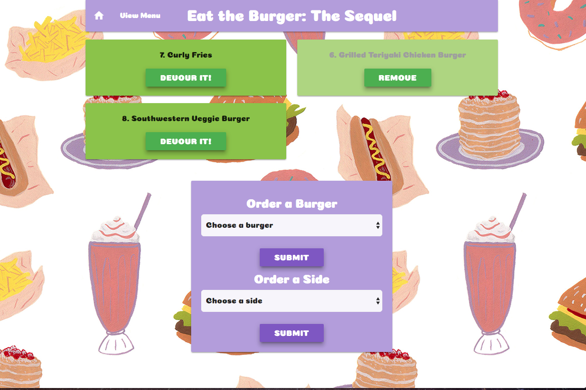
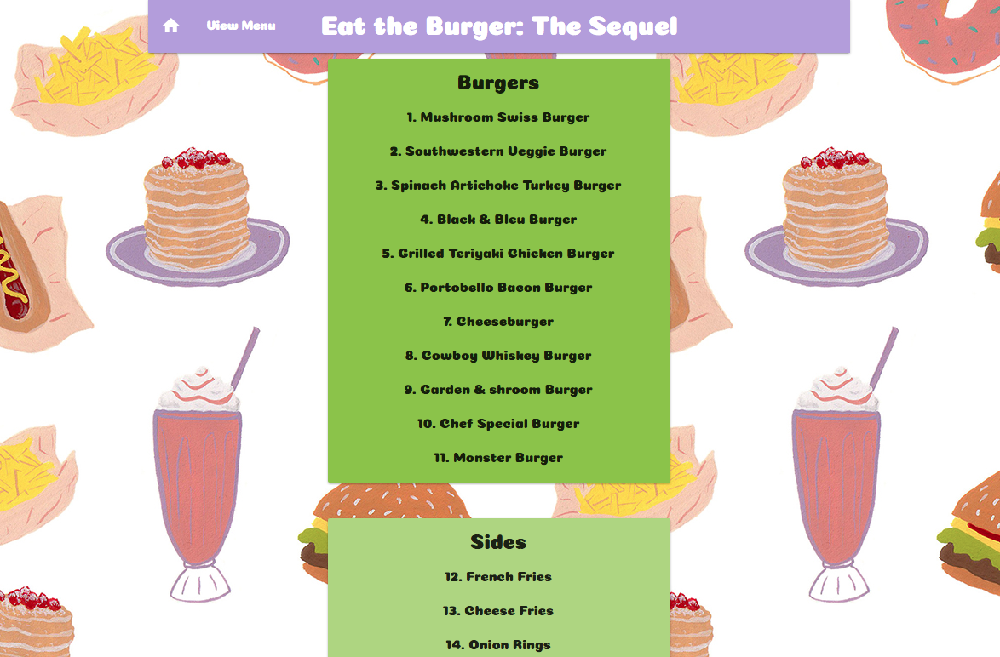

# burgerSequel

Created during Week 15 of Rutgers Coding Bootcamp. Node, Express, Handlebars, and MySQL burger app that allows user to select a burger or side and then 'devour' it. Remake of my original Burger app found [here](https://github.com/StefanieDing/burger). This uses the Sequelize ORM rather than raw MySQL queries.

## Getting Started
https://peaceful-anchorage-45179.herokuapp.com/

## Screen Shots


Index Page


Menu Page

## Technologies used
- Node.js
- Handlebars - http://handlebarsjs.com/
- Sequelize - http://docs.sequelizejs.com/en/v3/
- sequelize NPM Package -https://www.npmjs.com/package/sequelize
- express NPM Package - https://www.npmjs.com/package/express
- body-parser NPM Package - https://www.npmjs.com/package/body-parser
- method-override NPM Package - https://www.npmjs.com/package/method-override
- express-handlebars NPM Package - https://www.npmjs.com/package/express-handlebars
- mysql NPM Package - https://www.npmjs.com/package/mysql

### Prerequisites

```
- Node.js - Download the latest version of Node https://nodejs.org/en/
- Materialize - Add CDN link http://materializecss.com/getting-started.html
```

## Built With

* Sublime Text - Text Editor
* Node
* Sequelize
* Materialize - Wireframe

## Authors

* **Stefanie Ding** - *Node.js/JS/Handlebars* - [Stefanie Ding](https://github.com/StefanieDing)